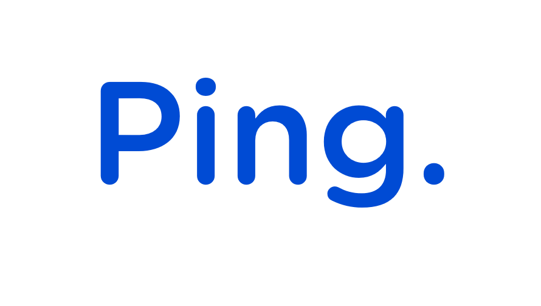

### **Clayton G C Santos**
sócio fundador

---

# Visão geral :

Ping. Uma solução de gestão de processos, documentos e assinaturas fim a fim, all-in-one, orientado a fluxo, automações e inteligência de negócio.

# Problema :
Dificuldade do tratamento das informações. Lentidão para fechamento de contratos, análises de compliance,auditorias e tomada de decisão, em inúmeros sistemas que não se comunicam ou não tratam o fluxo de forma unificada. 

 ---

# Vídeo 🎞️

---

# Desafios de uma startup 🚀

- Ser relevante (PMF - Product Market Fit);

- Burocracia;

- Custo operacional;

- Incentivo;

---

# Pontos de atenção ⚠️

- Sócios;

- Capital;

- Mentoria;

- Receita;

---
# Fundamentos ⚖️ Objetivos:

Estamos em um momento em que o tempo para os fundamentos concorre com o tempo de fazer.

 - O que é necessário?
 - O que é relevante?
 - O que é diferencial?
---

# Necessário

- Português;
- Leitura em inglês;
- Algoritmos e Estrutura de Dados;
- Redes TCP/IP;
- SGBD - Bancos de Dados;
---

# Relevante

- Inglês, fala e escrita;
- Linux;
- Virtualização;
- Framework de programação;
- Repositório de código;
- Nuvem;
- Método;

---

# Diferencial

- Obstinado para resolver;
- Comunicar ideias;
- Criar consenso;
- Pontualidade e constância;
- Ética e honestidade;

---

# Oportunidades

- IA generativa;
- No-Code Apps;
- Complexidade das soluções;
- Integrações;

---